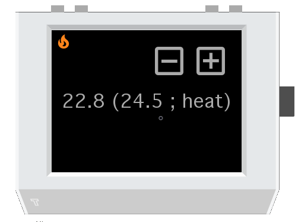

# Home Assistant 4 Tingbot #

Provides simple control of the Home Assistant server. (currently supports only controlling a climate thermostat)

## Features ##

* Basic control of a single climate thermostat via the buttons and the touch screen (set temperature, turning on/off)
* Customizing the app via `settings.json` (like entity ID of the thermostat, increment rate of the temperature)
* Plain and simple UI with icons provided by the [Material Design Icons][material-design-icons] maintained by Austin Andrews ([@templarian][material-design-icons-maintainer])
  * (same icons used by the Home Assistant server software)

## How to Use ##

1. Clone/Download this project
2. Open the project in Tide
3. Copy the `default_settings.json` and name it `settings.json`
4. Provide the correct URL, IP, port and path to the Home Assistant server
5. Provide the correct entity ID for the thermostat that you want to use
6. (Optional) Adjust the increment rate of the temperature as needed
7. Copy the `secrets.example.json` and name it `secrets.json`
8. Open Home Assistant in the web browser, log-in, edit the user
9. And then create a new permanent Access Token, copy it and replace the sample token within the `secrets.json` file with this one
10. Test it in the Tingbot Simulator within Tide before uploading/running on a real Tingbot/Raspberry Pi

<!-- TODO: Provide Info on the button action mappings -->

<!-- # LINKS AND REFERENCES # -->
[material-design-icons]: https://materialdesignicons.com/
[material-design-icons-maintainer]: https://twitter.com/templarian
